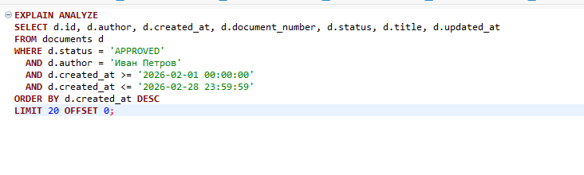
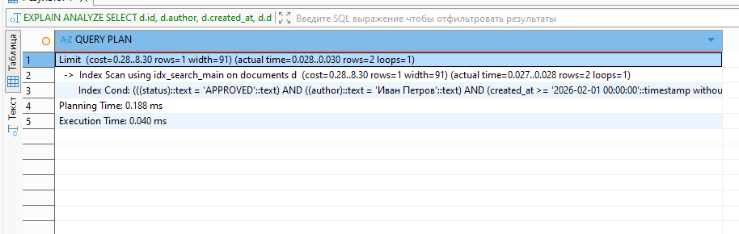

### Пример поискового запроса с 2012 записями без индексов

### Результат исходного запроса

### Результат того же запроса, но уже с созданным составным индексом по полям: status, author, created_at:

Время планировки запроса заняло побольше времени, а время исполнения кратно меньше. 
Индекс использовался составной, потому что он занимает меньше места, а также обновляется быстрее, чем 3 отдельных. В идеале тут необходимо было бы применить партицирование, то есть разнести на несколько таблиц, поскольку вставок будет много (скорее всего поиск аналогично) и в конечном счете индекс будет перестраиваться часто. 